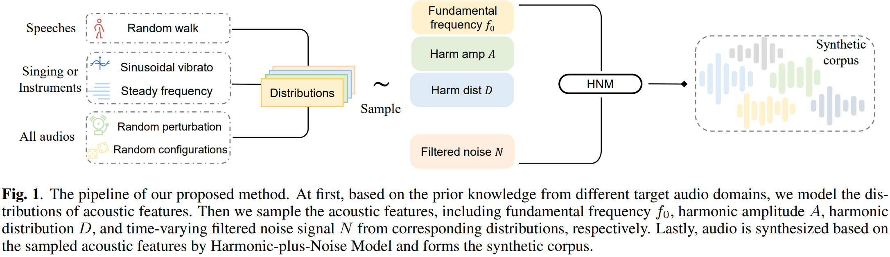
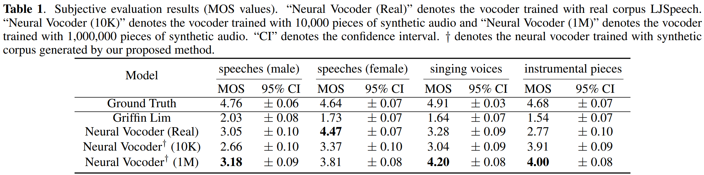

# A Synthetic Corpus Generation Method for Neural Vocoder Training
:page_with_curl:[[Paper](https://ieeexplore.ieee.org/document/10094786)] :cd:[[Demo](https://zerlinwang.github.io/synthetic-corpus-vocoder)]
---
*Abstract*: Nowadays, neural vocoders are preferred for their ability to synthesize high-fidelity audio. However, training a neural vocoder requires a massive corpus of high-quality real audio, and the audio recording process is often labor-intensive. In this work, we propose a synthetic corpus generation method for neural vocoder training, which can easily generate synthetic audio with an unlimited number at nearly no cost. We explicitly model the prior characteristics of audio from multiple target domains simultaneously (e.g., speeches, singing voices, and instrumental pieces) to equip the generated audio data with these characteristics. And we show that our synthetic corpus allows the neural vocoder to achieve competitive results without any real audio in the training process. To validate the effectiveness of our proposed method, we performed empirical experiments on both speech and music utterances in subjective and objective metrics. The experimental results show that the neural vocoder trained with the synthetic corpus produced by our method can generalize to multiple target scenarios and has excellent singing voice (MOS: 4.20) and instrumental piece (MOS: 4.00) synthesis results.

<div align="center">
    
</div>
<div align="center">
    
</div>

## Installation
You can simply install packages by PyPI with the following command:
```bash
pip install -r requirements.txt
```
## Quick Start
- Start to generate a synthetic corpus with 100 pieces of audio
```bash
python corpus_generate.py
```
